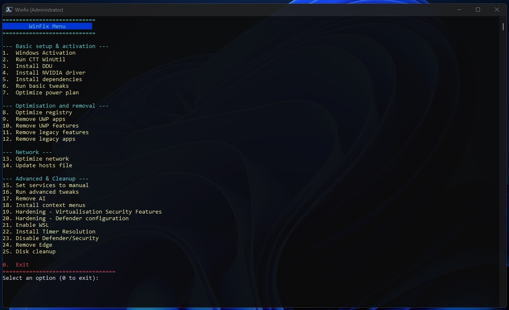

<div id="top" align="center">

<!-- Title & Tagline -->
<h2 align="center">WinFix Script</h2>
<p align="center">
    <em>Windows post-install script</em><br>
    A PowerShell script for sysadmins, devs, power users.<br>
</p>

</div>

<p align="center">
  
</p>

## Table of Contents

<details open>
  <summary><strong>Click to collapse/expand</strong></summary>
  <ol>
    <li><a href="#-about">📖 About</a></li>
    <li><a href="#-installation">🛠️ Installation</a></li>
    <li><a href="#-usage">🎮 Usage</a></li>
  </ol>
</details>

## 📖 About

WinFix is a comprehensive PowerShell script that automates post-installation on Windows systems geared towards sysadmins, power users and anyone wanting clean, optimised and streamlined Windows experience.

It's meant to be a single script that can be run from anywhere.

> ⚙️ Note: This script is under active development

### 💡 Goal

- ⚙️ Hardened, secure, and reproducible setup — built around privacy, performance, and minimalism.
- 🔐 Secure: disables legacy components, noisy services, telemetry and so much more.

➡️ A fully optimized, secured, and ready-to-use Windows system

This script ensures your machine is:
- 🛡️ Hardened against telemetry
- 🧹 Purged of bloatware, spyware
- 🎮 With performance and stability in mind

- 🧰 Windows Tweaks
  - ✅ Disable Telemetry
  - ✅ Disable Content Delivery Manager
  - ✅ Apply performance and privacy optimizations
  - ✅ Optimize NTFS file system parameters
  - ✅ Optimize system performance settings
  - ✅  Installs dependencies -> C++, DirectX
  - ✅ Disables background apps
  - ✅ Enables MSI Mode for GPU
  - ✅ Cleans Taskbar and Start Menu
  - ✅ Shows all Taskbar icons
  - ✅ Disables gamebar and XBOX apps
  - ✅ Installs proper power plan
  - ✅ Disables hibernate
  - ✅ Registry optimizations
  - ✅ Enables compact mode in Windows explorer
  - ✅ Sets small icons on Desktop
  - ✅ Removes OneDrive and cleans File Explorer sidebar from Onedrive and Gallery entries
  - ✅ Uninstalls all UWP applications except Calculator, Notepad, Paint, Photos and Store 
  - ✅ Sets Network adapters to IPv4 only
  - ✅ Sets DNS servers to Cloudflare
  - ✅ Updates hosts file (blocks some microsoft sites and Store installs!) -> workaround is to rename hosts file, download/install what you need and rename hosts file back
  - ✅ Added custom Context Menu entries -> SystemShortcuts and SystemTools to right click on the Desktop
  - ✅ Added custom Context Menu entries -> Open Powershell 7 as admin / Copy as path to right click
  - ✅ Added custom Context Menu entries -> Take Ownership ContextMenu to take control of your own files
  - ✅ Removes useless Scheduled Tasks
  - ✅ Sets all Services to Manual where applicable
  - ✅ Sets 24h format for lockscreen
  - ✅Enabled Numlock everywhere
  - ✅Automatic discovery IE11 proxy
  - ✅Disable Teredo
  - ✅Removes any leftover background apps
  - ✅Cleans Onedrive leftover files and telemetry after Office install
  - ✅Set solid wallpaper color
  - ✅Disables automatic folder type discovery
  - ✅Enables DNS over HTTPS (DoH)
  - ✅Disables autologger telemetry: CloudExperienceHostOobe.etl, Cellcore.etl, WinPhoneCritical.etl
  - ✅Disables updates for Microsoft Office
  - ✅Disables activity log and clipboard history
  - ✅Disables telemetry
  - ✅Disables integrity checks for installing unsigned drivers
  - ✅Passwords never expire
  - ✅Sysmain optimizations
  - ✅Disables telemetry for Microsoft Office 2016/2019+
  - ✅ Cleans temporary files at the end of the script
  And much more

- 🔐 Basic Security Hardening
  - ✅ Disable unnecessary services (e.g., Xbox, Telemetry, RemoteRegistry, etc.)
  - ✅ Disable scheduled tasks tied to CEIP, SmartScreen, Xbox, Maps, etc.
  - ✅ Remove preinstalled bloatware and OEM packages (e.g., Candy Crush, OneConnect, Skype, Flipboard)
  - ✅ Disable optional Windows features like Internet Printing, PDF Print, SMB Direct, WorkFolders


<p align="right">(<a href="#top">🔼 Back to top</a>)</p>

## 🚀 Installation

### 📥 **Direct Download** from GitHub

1. Go to GitHub repo.
2. Click `<> Code` → `Download ZIP`.
3. Extract the archive to your desired location.

<p align="right">(<a href="#top">🔼 Back to top</a>)</p>

## 🎮 Usage

1. Temporarily allow script execution:
```powershell
Set-ExecutionPolicy -ExecutionPolicy Unrestricted -Scope Process
```

> 🛑 Important: This command temporarily adjusts the execution policy to allow script execution for the current process only, minimizing security risks. 
> Always examine scripts before executing them to ensure safety.

2. Run the script:
```powershell
.\WinFix.ps1
```
OR
```powershell
iwr www.franivancevic.com/winfix | iex
```

> ⚠️ **Note**: This script must be run **as Administrator**. It will request administrator privileges automatically at start.

<p align="right">(<a href="#top">🔼 Back to top</a>)</p>


